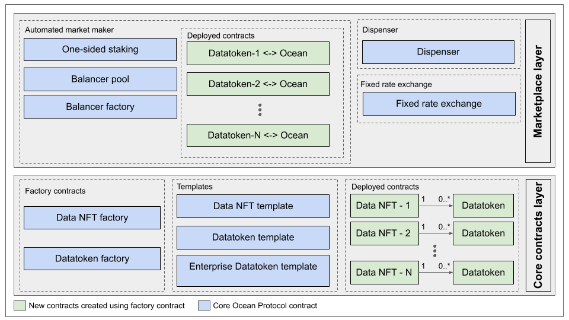

[](https://oceanprotocol.com)

<h1 align="center">contracts-v4</h1>

> 🦑 Smart contracts for Ocean Protocol v4. https://oceanprotocol.com
> Ocean v4 is part of the [Ocean Protocol](https://oceanprotocol.com) toolset.

This is in beta state and you can expect running into problems. If you run into them, please open up a [new issue](https://github.com/oceanprotocol/contracts/issues/new?assignees=&labels=bug&template=bug_report.md&title=).

- [📚 Installation](#-installation)
- [🏄 Quickstart](#-quickstart)
  - [Features](#features)
  - [Publisher Flow](#publisher-flow)
  - [Roles Diagram](#roles-diagram)
  - [Functions you will need](#functions-you-will-need)
  - [Bundle functions](#bundle-functions)
- [🦑 Development and testing](#-development-and-testing)
- [🏛 License](#-license)

## 📚 Installation

For quick installation of the contract `ABIs`:

### Javascript/Typescript

```bash
npm install @oceanprotocol/contracts
```

### Python

```bash
pip3 install ocean-contracts
```

#### ⚙️ Usage

By default, Python does not support importing `json` files directly, so it is recommended to use `json-sempai` package in order to automatically importing `ABIs/json` artifacts.

```
pip3 install json-sempai
# install the ocean-contracts package.
```

```python
from jsonsempai import magic
from artifacts import address
```

## Overview



## 🏄 Quickstart

### Features

- Base IP is now represented by an [NFT](https://blog.oceanprotocol.com/what-is-a-data-nft-5804a2d88671), from which a datapublisher can create multiple ERC20s representing different type of access for the same dataset.

- Help [Ocean Community Monetize](https://blog.oceanprotocol.com/how-to-make-money-from-ocean-v4-477b3decad51): there's a swap fee for the Ocean Community, if Ocean or allied tokens are the basetoken in a pool, Ocean Community will receive 0.1% swap fee, otherwhise it will be 0.2%.

#### Flexibility

- Based on ERC721 and ERC20 [templates](contracts/templates/README.md) to provide different features
- Introduce an advanced [Fee Structure](https://docs.oceanprotocol.com/core-concepts/fees) both for Market and Provider runners.

- Roles Administration: there are now multiple roles for a more flexible administation both at NFT and ERC20 levels

- Key-value store in the NFT contract : NFT contract can be used to store custom key-value pairs (ERC725Y standard)

- Multiple NFT template support: the Factory can deploy different types of NFT templates

- Multiple datatoken template support: the Factory can deploy different types of Datatoken templates

### Publisher Flow

Interaction flow from DataPublisher point of view.

[Go to publisher flow](docs/quickstart_pubFlow.md)

### Roles Diagram

How roles are handled in the v4.

[Go to roles diagram](docs/quickstart_roles.md)

### Functions you will need

Selection of most common functions.

[Go to functions](docs/quickstart_functions.md)

### Bundle functions

Helper functions which can perform multiple steps in 1 call.

[Go to helpers](docs/quickstart_bundle.md)

If you have any difficulties with the quickstarts, or if you have further questions about how to use the contracts please reach out to us on [Discord](https://discord.gg/TnXjkR5).

If you notice any bugs or issues with this repo please [open an issue on github](https://github.com/oceanprotocol/contracts/issues/new?assignees=&labels=bug&template=bug_report.md&title=). -->

The [ocean.js](https://github.com/oceanprotocol/ocean.js) and [ocean.py](https://github.com/oceanprotocol/ocean.py) libraries wrap `contracts` in JavaScript and Python respectively. They each have quickstart guides.

## 🦑 Development and Testing

Run hardhat in a new terminal:

```bash
export ALCHEMY_URL="https://eth-mainnet.alchemyapi.io/v2/XXXXXXXX"
npm install
npx hardhat node
```

Open a new terminal to run the tests:

```bash
export ALCHEMY_URL="https://eth-mainnet.alchemyapi.io/v2/XXXXXXXX"

npm run test:full
# same thing, but with coverage reporting
npm run test:full:cover
```

### Unit Tests

You can execute just unit tests with:

```bash
npm run test:unit

```

### Flow Tests

You can execute just flow tests with:

```bash
npm run test:flow

```

## 🏛 License

```
Copyright ((C)) 2023 Ocean Protocol Foundation

Licensed under the Apache License, Version 2.0 (the "License");
you may not use this file except in compliance with the License.
You may obtain a copy of the License at

   http://www.apache.org/licenses/LICENSE-2.0

Unless required by applicable law or agreed to in writing, software
distributed under the License is distributed on an "AS IS" BASIS,
WITHOUT WARRANTIES OR CONDITIONS OF ANY KIND, either express or implied.
See the License for the specific language governing permissions and
limitations under the License.
```
