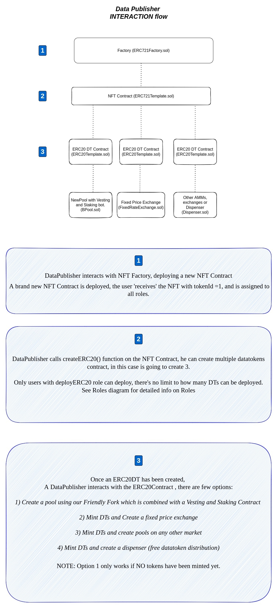

# Quickstart: Publisher flow

## This is a sample on how a data publisher is going to interact with the contracts.

### DataPublisher is going to create a new NFT contract, then from there will deploy 3 new DTs used for different licensings, and then create a different type of go to market strategy for each DT. No Roles are used in this one, since the Data Publisher is the NFTOwner, he has all permissions.

