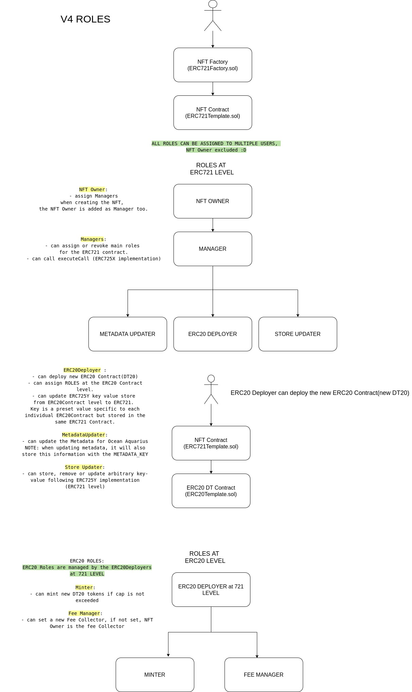

# Quickstart: ROLES

All roles can be assigned to multiple users

## ERC721 ROLES

### - NFT Owner: 
- assign Managers
- when creating the NFT, the NFT Owner is added as Manager and all main roles.

### - Managers:
- can assign or revoke main roles for the ERC721 contract.
- can call executeCall (ERC725X implementation) 

### - ERC20Deployer:

   - can assign ROLES at the ERC20 Contract level.

   - can update ERC725Y key value store from ERC20Contract level to ERC721. Key is a preset value specific to each individual ERC20Contract but stored in the same ERC721 Contract.

   - can deploy a new pool with vesting and staking, or a fixed price exchange.

   - can assign roles at the ERC20 level, see below

### - MetadataUpdater:

   - can update the Metadata for Ocean Aquarius
  NOTE: when updating metadata, it will also save this information with the METADATA_KEY into the store

### - Store Updater:

   - can store, remove or update arbitrary key-value following ERC725Y implementation (ERC721 level)

## ERC20 ROLES

ERC20 Roles are managed by the ERC20Deployers at 721 LEVEL

### Minter: 
   - can mint new DT20 tokens if cap is not exceeded

### Payment Manager: 
   - can set a new Payment Collector, if not set, NFT Owner is the Payment Collector (gets DT consumed after market and community fee)

#### When an NFT is transferred, all ROLES ARE AUTOMATICALLY REVOKED both at 721 and 20 level and feeCollector is set to NFT Owner.
#### The new Owner is automatically assigned as Manager and all MAIN ROLES. 

Both in ERC721 and ERC20 contract there’s a function called cleanPermissions:
ERC721: clean all permissions: Manager, ERC20Deployer, MetadataUpdate,Store Updater. After this call even the NFT Owner has to reassign itself as Manager.
ERC20: clean Minter and Payment Manager Permissions. 

